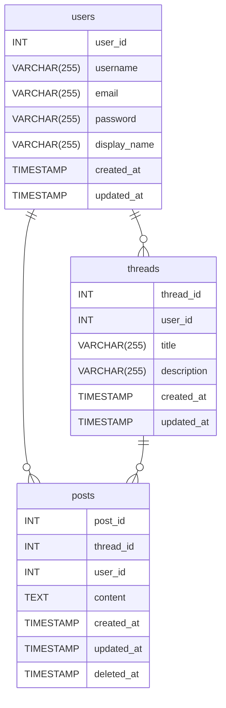

# 掲示板システム データベース設計

## テーブル一覧

- users（ユーザーテーブル）
- threads（スレッドテーブル）
- posts（投稿テーブル）
- 【保留】boards（掲示板テーブル）
- 【保留】attachments（添付ファイル管理テーブル）

## ER 図

## users（ユーザー管理テーブル）

| カラム名     | データ型     | 制約                                                  | 説明           |
| ------------ | ------------ | ----------------------------------------------------- | -------------- |
| user_id      | INT          | PRIMARY KEY, AUTO_INCREMENT                           | ユーザー ID    |
| username     | VARCHAR(255) | UNIQUE, NOT NULL                                      | ユーザー名     |
| email        | VARCHAR(255) | UNIQUE, NOT NULL                                      | メールアドレス |
| password     | VARCHAR(255) | NOT NULL                                              | パスワード     |
| display_name | VARCHAR(255) |                                                       | 表示名         |
| created_at   | TIMESTAMP    | DEFAULT CURRENT_TIMESTAMP                             | 作成日時       |
| updated_at   | TIMESTAMP    | DEFAULT CURRENT_TIMESTAMP ON UPDATE CURRENT_TIMESTAMP | 更新日時       |

↑ にいろいろと書いたが、Rails が提供するユーザー管理に沿えれば、別にそれで構わない。

## threads（スレッド管理テーブル）

| カラム名    | データ型     | 制約                                                  | 説明                      |
| ----------- | ------------ | ----------------------------------------------------- | ------------------------- |
| thread_id   | INT          | PRIMARY KEY, AUTO_INCREMENT                           | スレッド ID               |
| user_id     | INT          | FOREIGN KEY (users)                                   | スレッド作成者ユーザー ID |
| title       | VARCHAR(255) | NOT NULL                                              | スレッドタイトル          |
| description | VARCHAR(255) | NOT NULL                                              | スレッド説明文            |
| created_at  | TIMESTAMP    | DEFAULT CURRENT_TIMESTAMP                             | 作成日時                  |
| updated_at  | TIMESTAMP    | DEFAULT CURRENT_TIMESTAMP ON UPDATE CURRENT_TIMESTAMP | 更新日時                  |

## posts(スレッド内の投稿管理テーブル)

| カラム名   | データ型  | 制約                                                  | 説明              |
| ---------- | --------- | ----------------------------------------------------- | ----------------- |
| post_id    | INT       | PRIMARY KEY, AUTO_INCREMENT                           | 投稿 ID           |
| thread_id  | INT       | FOREIGN KEY (threads)                                 | スレッド ID       |
| user_id    | INT       | FOREIGN KEY (users)                                   | 投稿者ユーザー ID |
| content    | TEXT      | NOT NULL                                              | 投稿内容          |
| created_at | TIMESTAMP | DEFAULT CURRENT_TIMESTAMP                             | 作成日時          |
| updated_at | TIMESTAMP | DEFAULT CURRENT_TIMESTAMP ON UPDATE CURRENT_TIMESTAMP | 更新日時          |
| deleted_at | TIMESTAMP | ON UPDATE CURRENT_TIMESTAMP                           | 削除日時          |

deleted_at に日付が入っているなら「このコメントは削除されました」の表記にする。

## 【保留】boards（掲示板テーブル）

複数の掲示板をとりまとめるテーブルを作成しようと思いましたが、やめる。
いったん、掲示板は 1 つのみとします。

## 【保留】attachments（添付ファイル管理テーブル）

投稿にファイルを添付できるようにしようかと思ったが、いったん後で。  
単に posts テーブルにカラムを作成して、アップロードしたファイル名 + 乱数 + timestamp で、静的アセット領域へのパスを書いておくだけでも良いかも。

## 保留にしたテーブル・機能

- 掲示板を複数にする。boards（掲示板テーブル）の作成。
- ファイル添付可能にする。attachments（添付ファイル管理テーブル）の作成
  - 単にアップロードしたファイルに + 乱数 + timestamp でリネームして保存で良い気もするが。
- 検索機能
  - Rails より SQL がどうのこうのになりそうなので保留。
